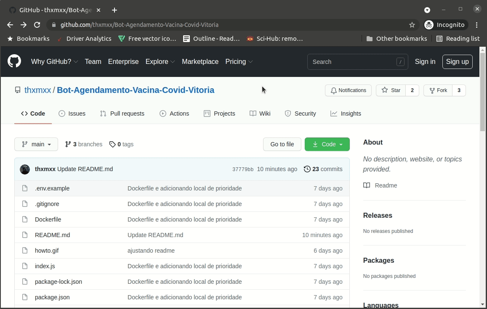

# Versão Vila Velha

## Chrome

Abra o [script](https://raw.githubusercontent.com/thxmxx/Bot-Agendamento-Vacina-Covid-Vitoria/vila-velha/script.js) e siga as instruções (para abrir o console do chrome aperte `F12`):



## Docker

```
docker run -e NOME="Fulano da Silva" -e CPF="11111111111" -e TELEFONE="2799999999" -e EMAIL="fulano@gmail.com"  -e DATANASC="1990-12-1" -e PRIORIDADE="centro" -it thxmxx/vacina-vitoria:1.0.1-vv
```

## Node.js
1. ```
    npm install
    ```

2. ```
    node index.js
    ```
